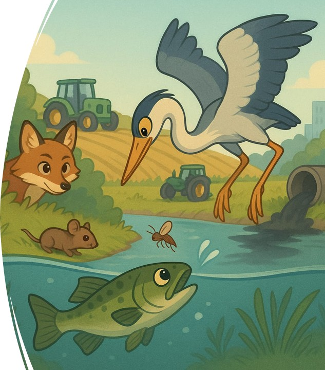

### 

**Public visé :** Primaire (de CP à CM)

**But du jeu :** Dans ce jeu, vous devez reconstituer une chaîne alimentaire soumise à trois sources de contamination (ville, industrie, agriculture) et retracer la pollution le long de cette chaîne afin de comprendre les différentes voies de contamination.

**Intérêts :**

-   Comprendre les interactions trophiques

-   Appréhender les voies d'exposition à la pollution

-   Sensibiliser à l'impact des différents milieux et pratiques humaines sur la contamination des organismes

{fig-align="left" width="343"}

**Spécificités :**

-   10 chaînes alimentaires proposées (aquatiques, terrestres ou mixtes, couvrant tous les écosystèmes existants)

-   Plusieurs niveaux de difficultés (via des pastilles de contamination uni- ou multicolores)

-   Bande dessinée d'accompagnement pour l'introduction et la conclusion de cet atelier

**Matériels utilisés** **:** soon

**Vidéo explicative :** soon

**Print & Play** **:** soon
