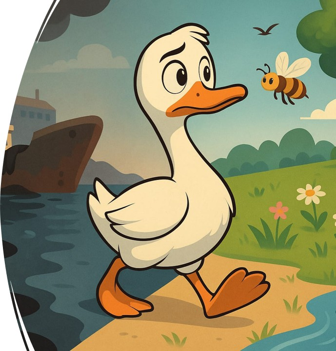
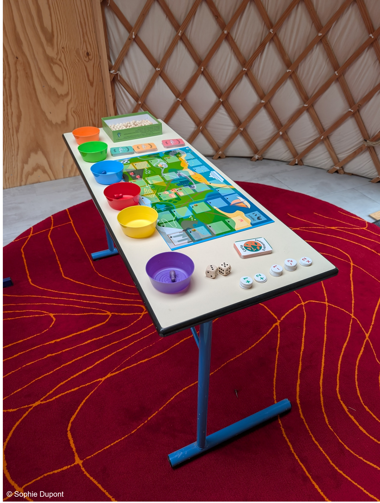

**Public visé :** Collège et +

**But du jeu :** Dans ce jeu, vous incarnez un organisme vivant qui traverse différents milieux et habitats. L'objectif est de rejoindre la case "ARRIVÉE" en ayant le moins de billes de pollution dans votre récipient individuel.

**Intérêts :**

-   Sensibiliser aux notions de contamination, de polluants et de leur distribution/transfert/devenir dans l'environnement

-   Introduire des notions de base de chimie, d'écotoxicologie, et des impacts environnementaux des polluants

-   Encourager la réflexion collective et la prise de décisions stratégiques

{width="218"}

**Spécificités :**

-   Plusieurs chaînes alimentaires proposées (total de 10 : aquatiques, terrestres ou mixtes couvrant tous les écosystèmes existants)

-   Plusieurs niveaux de difficultés

-   Bande dessinée d'accompagnement pour l'introduction et la conclusion
