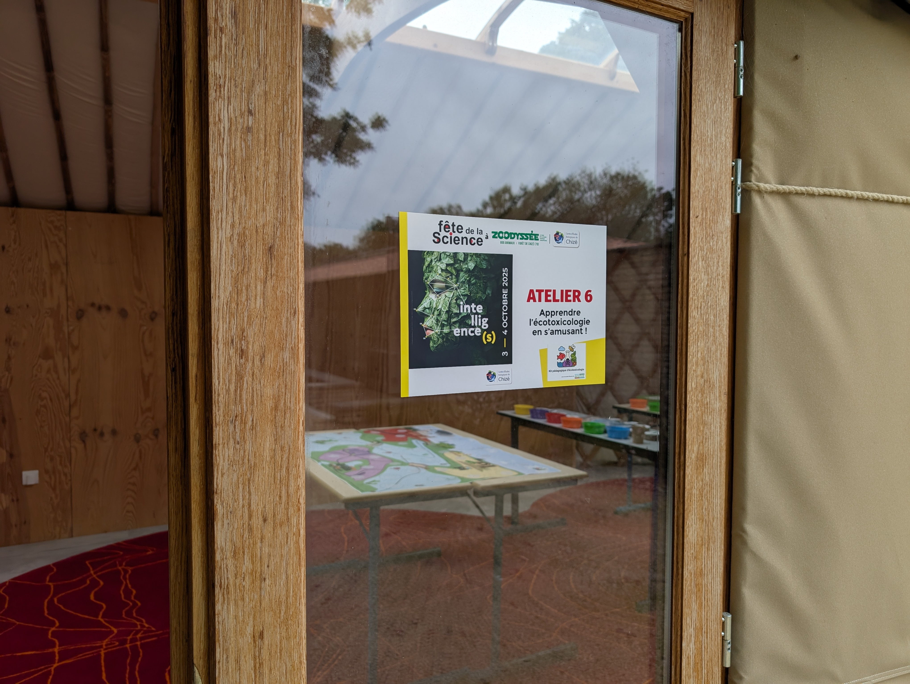
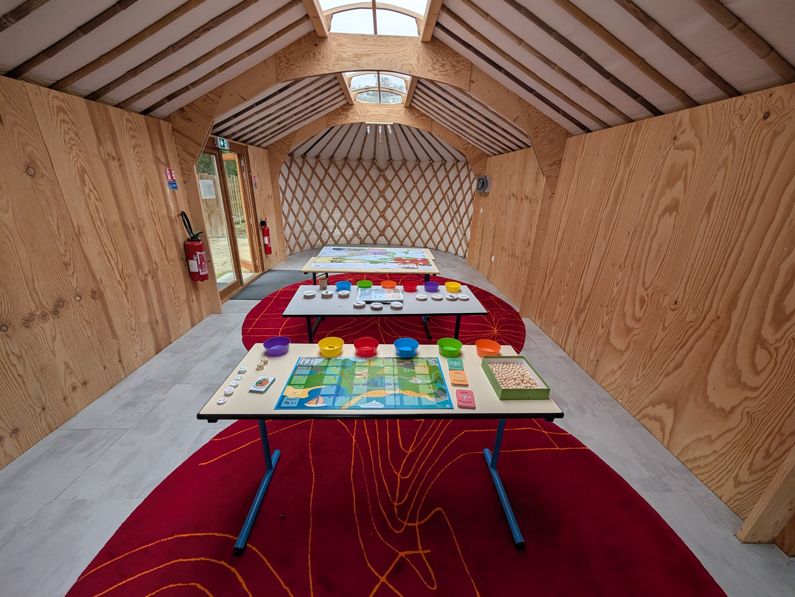
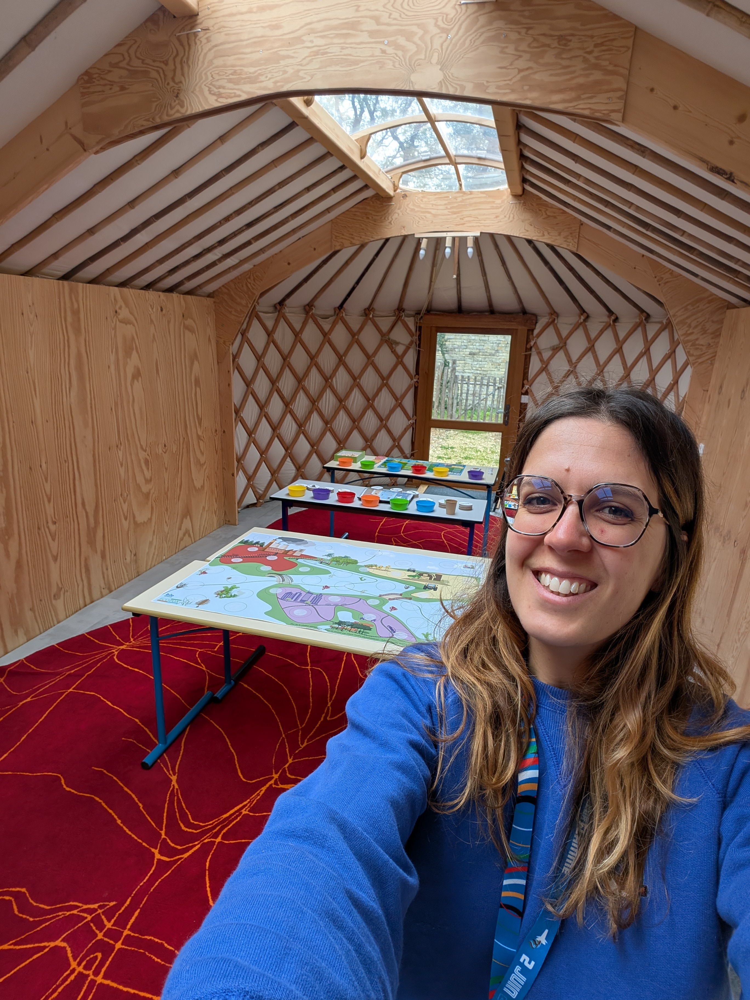

**Vous souhaitez que nous intervenions dans votre établissement (scolaire, institutionnel) ou vous aidions à préparer votre propre animation ? N'hésitez pas à nous contacter !**

➜ [[Journée Grand Public du GFP Ecotoxicologie]{.underline}](https://www.linkedin.com/feed/update/urn:li:activity:7466889381463769088/?utm_source=share&utm_medium=member_desktop&rcm=ACoAABOXOqQBGfJSqo7iqWtV14FKHEAP8RJH0fk)[, La Rochelle, le 30 mai 2026]{.underline}

*"Installée au Comm'on Lab de La Rochelle, j'ai pu rencontrer des rochelais·es et échanger avec eux sur les problématiques des contaminants au travers des deux ateliers du kit. Un grand merci au comité d'organisation pour la tenue d'un tel évènement !"*

➜ [Intervention dans le cadre de la formation des collégien·nes et lycéen·nes de la région niortaise, Lycée Jean Macé et Lycée Paul Guérin, les 23 janvier et 04 février 2026]{.underline}

➜ [La Fête de la Science 2025, CEBC/Zoodysée, les 03 et 04 octobre 2025]{.underline}

*"Le vendredi, j'ai pu sensibiliser des élèves de CM, 5ème et 3ème à l'écotoxicologie au travers des deux ateliers du kit. Le samedi, j'ai pu initier des discussions et réflexions autour de l'écotoxicologie grâce au kit auprès des publics ! C'était une super expérience ! Un grand merci au Zoodyssée pour leur accueil dans cette magnifique yourte et au CEBC pour leur invitation à participation et organisation !"*

{fig-align="center" width="331"}

{width="329"}

{width="280"}
