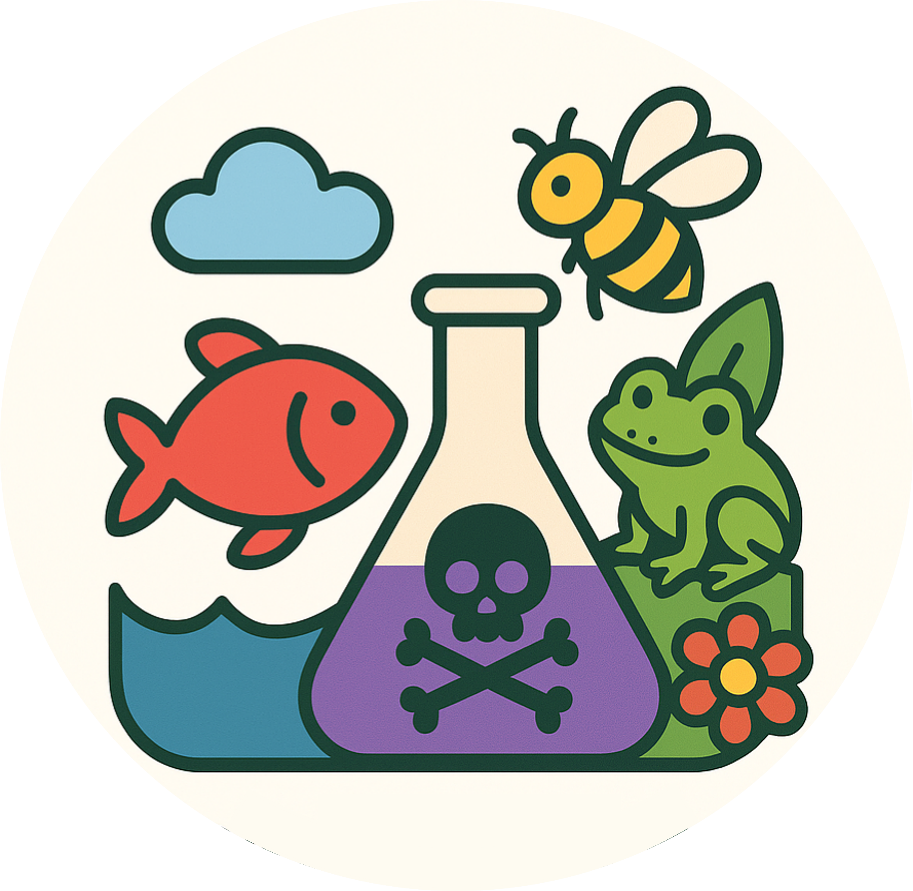
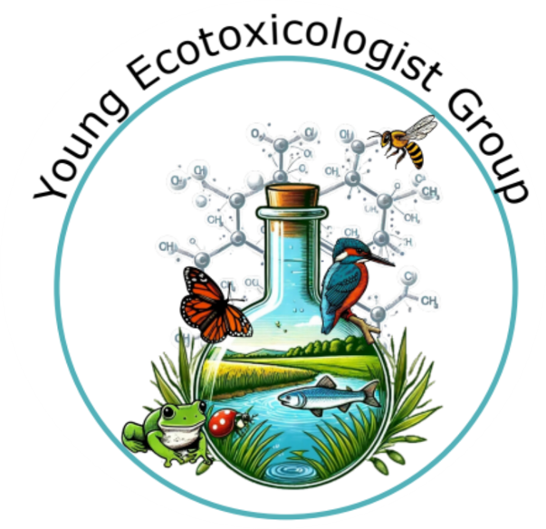
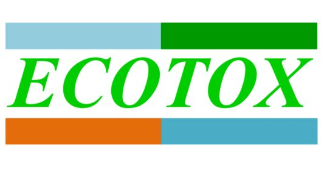

{fig-align="center" width="191"}

Huit jeunes chercheur*·*es du [YEG](https://ecotox.hub.inrae.fr/groupe-jeunes) ("Young Ecotoxicologists Group", le groupe des jeunes écotoxicologues du [réseau ECOTOX INRAE](https://ecotox.hub.inrae.fr/le-reseau)) s'impliquent depuis plusieurs mois dans la création d'un kit pédagogique autour de l'écotoxicologie afin de sensibiliser les différents publics à ce domaine de recherche à ampleur sociétale de manière ludique et adaptée selon leur âge.

::: {style="display:flex; justify-content:center; align-items:center; gap:2rem;"}
{width="81"}

{width="129"}
:::

Un kit est composé de deux jeux sérieux indépendants :

-   Jeu de la Chaîne alimentaire

-   Jeu de l'Oie contaminée

*L'objectif de ce groupe de travail est de mettre à disposition [gratuitement]{.underline} les supports de jeux et d'assurer le prêt des kits édités à l'échelle nationale.*

*N'hésitez pas à nous écrire pour réserver votre période de prêt (via l'Onglet "Nous contacter") !*
