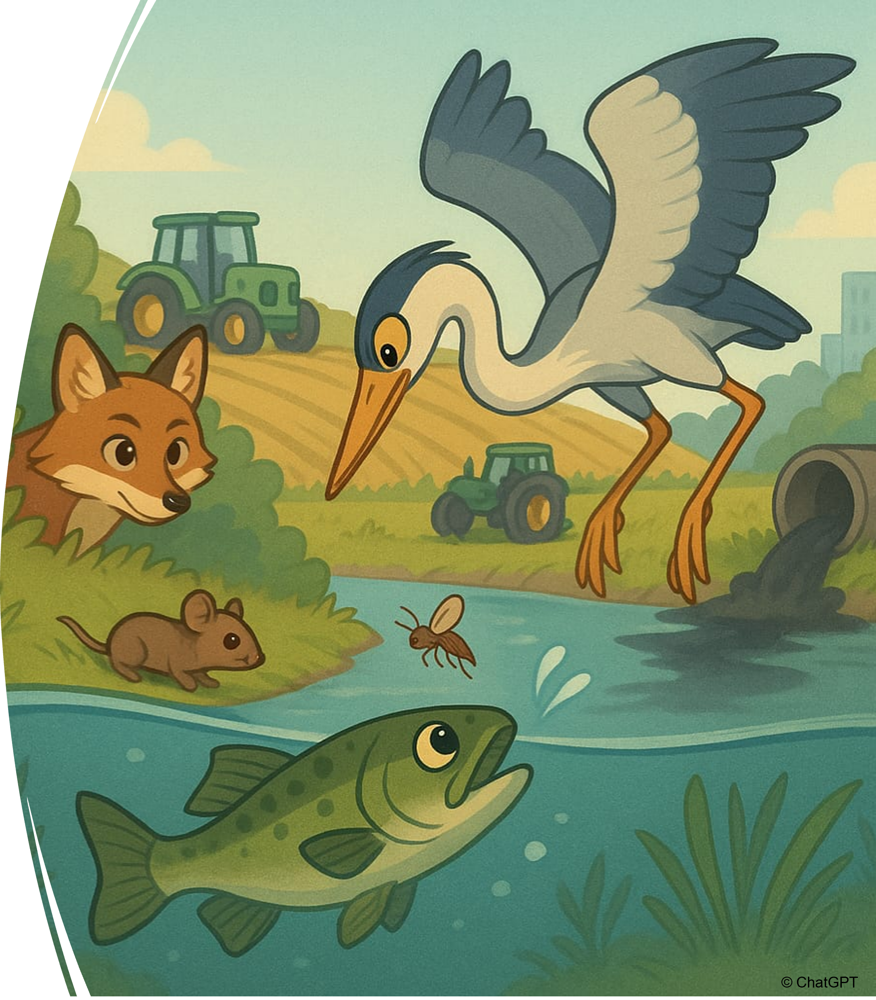
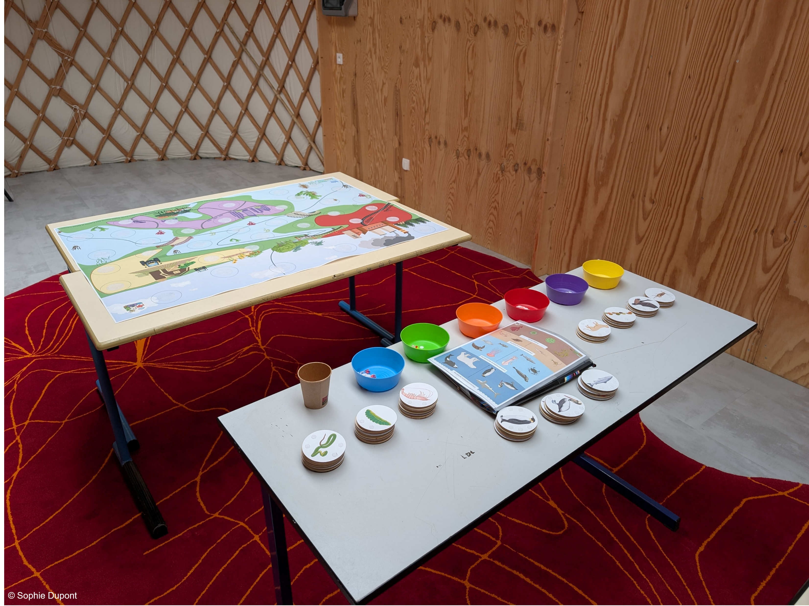

{fig-align="center"}

**Public visé :** Primaire (de CP à CM)

**But du jeu :** Dans ce jeu, vous devez reconstituer une chaîne alimentaire soumise à trois sources de contamination (ville, industrie, agriculture) et retracer la pollution le long de cette chaîne afin de comprendre les différentes voies de contamination.

**Intérêts :**

-   Comprendre les interactions trophiques

-   Appréhender les voies d'exposition à la pollution

-   Sensibiliser à l'impact des différents milieux et pratiques humaines sur la contamination des organismes

{fig-align="center" width="343"}

**Spécificités :**

-   10 chaînes alimentaires proposées (aquatiques, terrestres ou mixtes, couvrant tous les écosystèmes existants)

-   Plusieurs niveaux de difficultés (via des pastilles de contamination uni- ou multicolores)

-   Bande dessinée d'accompagnement pour l'introduction et la conclusion de cet atelier

**Matériel utilisé** **:**

*(Ces différents items sont ceux utilisés pour la production des kits pédagogiques en prêt actuellement et peuvent donc vous servir à titre d'indication pour réaliser votre propre Jeu de la Chaîne alimentaire)*

| Fournisseur       | Référence                                                                                                                                                                                          |
|-------------------|----------------------------------------------------------------------------------------------------------------------------------------------------------------------------------------------------|
| Amazon            | Scratch Autocollant Double Face Extra Fort, Blanc Bande Auto-Adhésif Réutilisable Rond 5cm Adhesif Double Face Puissant pour Bricolage/Cadre Photos, 20 pièces                                     |
| Amazon            | 1008 Pcs Scratch Autocollant Rond, 504 Paires 10mm Pastille Scratch Autocollant Crochets et Boucles, Blanc Double Face Rond Pastille Adhesive Collant Point, pour DIY, Artisanat etc.              |
| Amazon            | AVERY Zweckform L7788-25 Lot de 25 feuilles d'étiquettes rondes transparentes (150 pastilles adhésives, Ø 80 mm sur A4, autocollants ronds, à imprimer, autocollantes, résistantes aux intempéries |
| Amazon            | SENENQU Lot de 100 Disques de Bois Brut 10cm Tranche de Bois Brut Naturel 2.5mm, Rondin de Bois Décoratif pour Bricolage Artisanat Mariage Noël Décorations Étiquettes Cadeaux                     |
| Amazon            | 18 PCS Bol Plastique Reutilisable 370 ML,Saladier Plastique Camping,Bol Dejeuner Multicolores,Bols pour Salade de Fruits,Bols à Cereales de Collation Incassable,Bowl Soupe Sans Bpa pour Glace    |
| Amazon            | Elalove Gommettes Rondes Autocollantes 10mm - 20 Couleurs Vives - 6600 Pastilles Repositionnables - Idéal pour Organisation, Déco et Loisirs Créatifs                                              |
| Bureau Vallée     | Bâche intissée A0. Ref. 79359478                                                                                                                                                                   |
| Bureau Vallée     | Tube d'expédition carré carton brut - 10 cm x 10 cm x 90 cm - Logistipack. Ref. 79395431                                                                                                           |
| Toutpourlejeu.com | Sac tissu XXL pour pions de jeux 35 x 40 cm                                                                                                                                                        |

**Vidéo explicative :** *coming soon*

**Version "Print & Play"** **:** *coming soon*

N'hésitez pas à nous contacter (cf Onglet "Nous contacter") pour que nous vous accompagnions dans la préparation de votre atelier du Jeu de la Chaîne alimentaire.
