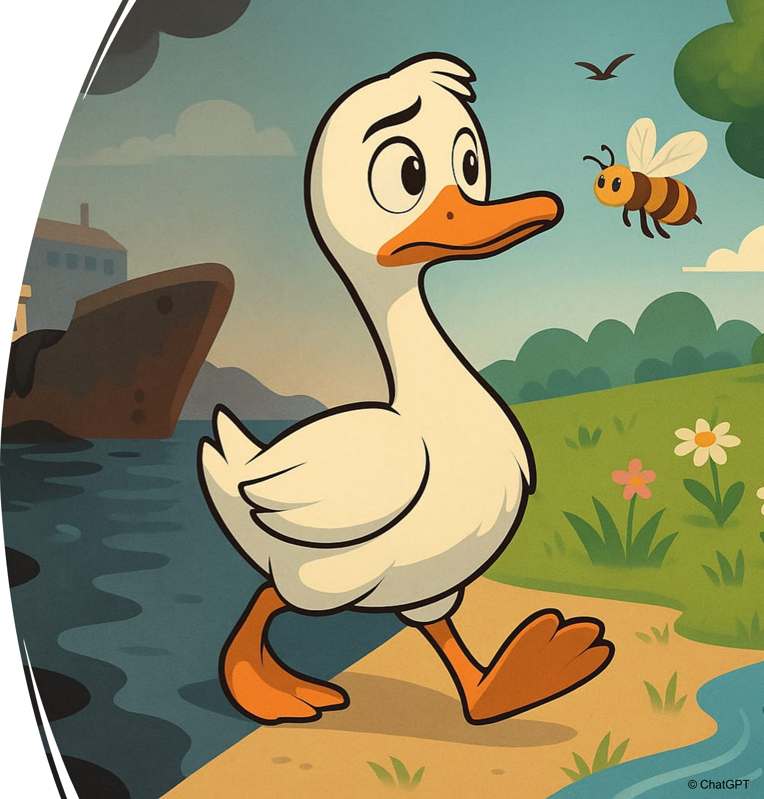

{fig-align="center"}

**Public visé :** Collège et +

**But du jeu :** Dans ce jeu, vous incarnez un organisme vivant qui traverse différents milieux et habitats. L'objectif est de rejoindre la case "ARRIVÉE" en ayant le moins de billes de pollution dans votre récipient individuel.

**Intérêts :**

-   Sensibiliser aux notions de contamination, de polluants et de leur distribution/transfert/devenir dans l'environnement

-   Introduire des notions de base de chimie, d'écotoxicologie, et des impacts environnementaux des polluants

-   Encourager la réflexion collective et la prise de décisions stratégiques

{fig-align="center" width="218"}

**Spécificités :**

-   Sensibiliser aux notions de contamination, de polluants et de leur distribution/transfert/devenir dans l'environnement

-   Introduire des notions de base de chimie, d'écotoxicologie, et des impacts environnementaux des polluants

-   Encourager la réflexion collective et la prise de décisions stratégiques

**Matériel utilisé** **:**

*(Ces différents items sont ceux utilisés pour la production des kits pédagogiques en prêt actuellement et peuvent donc vous servir à titre d'indication pour réaliser votre propre Jeu de l'Oie contaminée)*

| Fournisseur | Référence |
|----|----|
| Amazon | 18 PCS Bol Plastique Reutilisable 370 ML,Saladier Plastique Camping,Bol Dejeuner Multicolores,Bols pour Salade de Fruits,Bols à Cereales de Collation Incassable,Bowl Soupe Sans Bpa pour Glace |
| Toutpourlejeu.com | Dé en bois 25 mm de 1 à 6 pour jeu de société |
| Toutpourlejeu.com | Dé à jouer 12 faces opaques dodécaèdre à l'unité (couleur mise au hasard) |
| Toutpourlejeu.com | Boule 1.5 cm en bois - bille hêtre diamètre 15 mm |
| Toutpourlejeu.com | Sac tissu L+ 30 x 40 cm - grand sachet 100% coton |
| Toutpourlejeu.com | Pion joueur grand 25x60 mm en bois - 6 cm à l'unité |
| Loiseauplume | plateaux 6 volets format 63 x 34 cm, format plié 21 x 17cm Impression quadri HD pelliculée satiné recto, habillage couleur (au choix) au verso |
| Loiseauplume | planches A4 de 8 cartes recto verso, Impression quadri HD sur papier 300g pelliculé brillant coupe bords arrondis |
| Loiseauplume | boîtes 22 x 18 x 5 cm, Bas de boîte et couvercle habillage couleur, identique au plateau, Bas de boîte aménagé en compartiments adaptés aux éléments |
| Loiseauplume | jetons format 3cm diamètre recto, planche A4, Impression quadri HD pelliculé brillant contre collée sur carton blanc 1,5 mm d'épaisseur |

**Vidéo explicative :** *coming soon*

**Print & Play** **:** *coming soon*

N'hésitez pas à nous contacter (cf Onglet "Nous contacter") pour que nous vous accompagnions dans la préparation de votre atelier du Jeu de l'Oie contaminée.
