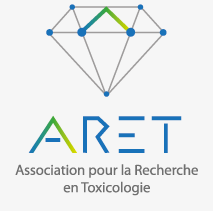

## ● Membres du groupe de travail 'Kit pédagogique' du YEG

### Jeu de la Chaîne alimentaire

-   Conception (dans l'ordre alphabétique) : DARDÉ Juliette, DUPONT Sophie, FUENTES Elva, TREVISAN Rafaël
-   Visuel de la bande-dessinée : TRAN Guillaume
-   Visuel du tapis de jeu : DUPONT Sophie
-   Fiches d'aide : DARDÉ Juliette

### Jeu de l'Oie contaminée

-   Conception (dans l'ordre alphabétique) : BELLIER Benjamin, DUPONT Sophie, FUENTES Elva, LE PICARD Coralie, PARNET Clément, PETITJEAN Quentin
-   Visuel du tapis de jeu : LE PICARD Coralie

### Site internet

-   Conception : BELLIER Benjamin, DUPONT Sophie
-   Administrateurs : BELLIER Benjamin, DUPONT Sophie, FUENTES Elva, LE PICARD Coralie

## ● Soutiens financiers et scientifiques / Partenaires

Nous remercions nos partenaires financiers et scientifiques qui nous ont accompagné durant la phase de développement des deux jeux et la production des premiers kits pédagogiques :

-   [Réseau ECOTOX INRAE](https://ecotox.hub.inrae.fr/)

    {width="119"}

-   [Association ARET](https://aret.asso.fr/)

    {width="99"}

-   [L'Oiseau plume](https://www.loiseauplume.fr/)

    {width="142"}

*Nous sommes continuellement à la recherche de soutien financier et logistique (communication, partenaires potentiels) pour nous aider à produire d'autres exemplaires du kit et à assurer sa pérennité ! N'hésitez pas à nous écrire sur l'adresse courriel dédiée au kit pédagogique : [kitpedagogique.yeg\@gmail.com](kitpedagogique.yeg@gmail.com)*

*Merci d'avance !*

## ● Annuaire du YEG

Vous retrouverez [ici](https://ecotox.hub.inrae.fr/groupe-jeunes/pages-profil) l'annuaire avec tous les membres du groupe.

{width="128"}
